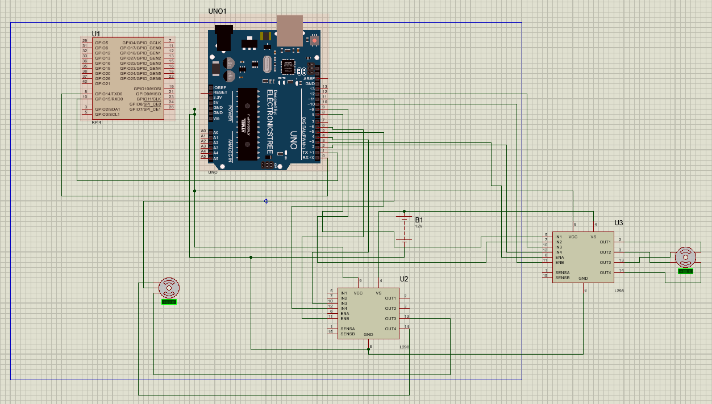

# Vision-Based Connect-4 Robot

This repository documents a cumulative mechatronics project that combines computer vision, embedded decision-making, and physical actuation to play Connect-4 autonomously. The system uses a Raspberry Pi 4 for board perception and move selection, then forwards the selected column to an Arduino-controlled dispensing mechanism.

## Current System Status

The current project state reflects Milestones 1, 2, and 3 together:

- MS1 established the hardware architecture, Proteus circuit design, and the initial mechanical concept for the dispensing mechanism.
- MS2 implemented and benchmarked the OpenCV preprocessing pipeline, including rotation correction, perspective warping, brightness and contrast conditioning, and Gaussian smoothing.
- MS3 extended the project into a closed-loop system by extracting a board-state matrix, evaluating the next move with Minimax plus alpha-beta pruning, and commanding the dispenser through serial communication.

At this stage the project demonstrates a complete perception-to-actuation loop with browser-visible operator modes, post-move camera verification, and an optional lightweight ML bonus path for token classification.

## Visual Highlights

<p align="center">
    
</p>
<p align="center"><em>Perspective-warp stage used to isolate the Connect-4 board before board-state extraction.</em></p>

<p align="center">
    
</p>
<p align="center"><em>Proteus circuit schematic showing the Raspberry Pi, Arduino Uno, L298N drivers, and actuator wiring used in the hardware setup.</em></p>

## Team

| Name | Student ID | Email |
|------|-----------|-------|
| Andrew Abdelmalak | 55-22771 | andrew.abdelmalak@student.guc.edu.eg |
| Daniel Boules | 55-5055 | daniel.boules@student.guc.edu.eg |
| David Girgis | 55-1481 | david.girgis@student.guc.edu.eg |
| Kirolous Kirolous | 55-18081 | kirolous.kirolous@student.guc.edu.eg |
| Samir Yacoub | 55-25111 | samir.yacoub@student.guc.edu.eg |
| Youssef Salama | 55-0540 | youssef.salama@student.guc.edu.eg |

**Affiliation**: Department of Mechatronics Engineering, German University in Cairo (GUC)

## End-to-End Architecture

1. Pi Camera V2 captures the Connect-4 board from an overhead view.
2. Raspberry Pi 4 preprocesses the frame using OpenCV.
3. HSV segmentation and morphological cleanup estimate token occupancy per cell.
4. The processed frame is converted into a `6 x 7` game-state matrix.
5. A Minimax-based decision layer selects the next legal move.
6. The chosen column is transmitted to the Arduino over serial as `1..7`.
7. The Arduino releases one token from the magazine, moves the carriage to the requested column, and returns home.
8. The Raspberry Pi re-observes the board and verifies that the commanded robot move appeared in the correct column.

## Repository Structure

```text
connect-4-robot/
├── arduino/
│   ├── m1_servo_gate_controller/
│   └── ms3_connectfour_dispenser/
├── assets/
│   └── figures/
├── milestones/
│   └── MS3.md
├── paper/
│   ├── main.tex
│   ├── references.bib
│   └── IEEEtran.cls
├── src/
│   ├── image_pipeline/
│   └── runtime/
├── .github/
│   └── workflows/
│       └── build-paper.yml
├── README.md
└── requirements.txt
```

## Milestone Timeline

### MS1

- Defined the electrical architecture in Proteus.
- Developed the mechanical dispenser concept in SolidWorks.
- Established the Raspberry Pi, Arduino, driver, and actuator stack.

### MS2

- Implemented the core image-processing pipeline in Python/OpenCV.
- Benchmarked the preprocessing stages on Raspberry Pi 4 and laptop hardware.
- Produced the cumulative MS2 paper draft and supporting figures.

### MS3 and Final Integration

- Added board-state extraction from the processed camera image.
- Integrated Minimax with alpha-beta pruning for move selection.
- Added browser-visible `manual`, `semi_auto`, and `auto` operator modes.
- Added serial robot dispatch and camera-based post-move verification.
- Updated Arduino firmware to accept column commands `1..7`, release exactly one token, move to the selected slot, and return home.
- Added an optional lightweight ML training and inference path for the milestone bonus.

## Published Artifacts

Available in this repository now:

- `paper/main.tex`: cumulative IEEE-style paper source for the final integrated milestone state.
- `paper/references.bib`: bibliography for the cumulative paper.
- `milestones/MS3.md`: concise milestone summary.
- `arduino/ms3_connectfour_dispenser/ConnectFour_Dispenser.ino`: integrated dispenser firmware.
- `src/runtime/connect4_brain.py`: main Raspberry Pi dashboard, control, and verification runtime.
- `src/runtime/train_cell_model.py`: lightweight ML training utility for cell classification.
- `.github/workflows/build-paper.yml`: GitHub Actions workflow for report compilation.

The ML path is optional and safe by design:

- `HSV` mode keeps the classical board-state pipeline only.
- `ML Only` uses a trained 3-class cell classifier (`empty`, `red`, `yellow`).
- `ML Auto` uses the ML classifier when confidence is high and falls back to HSV otherwise.

## Benchmarks (100-Iteration Mean)

| Operation | Raspberry Pi 4 (ms) | Laptop (ms) |
|-----------|---------------------|-------------|
| Rotation (bilinear) | 8.468 | 3.273 |
| Perspective warp | 3.596 | 1.768 |
| Brightness +60 | 0.734 | 0.888 |
| Contrast α=1.8 | 1.111 | 0.201 |
| Gaussian blur 5×5 | 0.757 | 0.097 |

Output quality is bit-for-bit identical on both platforms.

## Hardware Bill of Materials

| Component | Qty | Total (EGP) |
|-----------|-----|-------------|
| Raspberry Pi 4 (4 GB) | 1 | 5,950 |
| Arduino Uno | 1 | 450 |
| Pi Camera V2 | 1 | 2,150 |
| Positioning / release motors | 2 | 880 |
| L298N H-bridge driver | 2 | 170 |
| 12V 5A power supply | 1 | 300 |
| Wires & breadboard | 1 | 150 |
| **Total** | | **10,050 EGP** |

## Known Limitations

- HSV segmentation is sensitive to glare and lighting changes on the plastic board.
- The ML bonus path requires a labeled dataset of cropped cell images before it can replace or augment HSV reliably.
- Deeper Minimax search increases turn latency on the Raspberry Pi 4.
- Full-board analysis currently runs at a low frame rate relative to real-time play.
- Motor timing, encoder stop target, and return travel still need tuning for faster, more repeatable actuation.

## Paper Build

The cumulative report lives in `paper/main.tex`. The repository now includes a GitHub Actions workflow that compiles the paper automatically on pushes affecting `paper/**` or `assets/figures/**`, and also supports manual runs from the Actions tab.

## License

This repository is licensed under the MIT License. See `LICENSE`.
