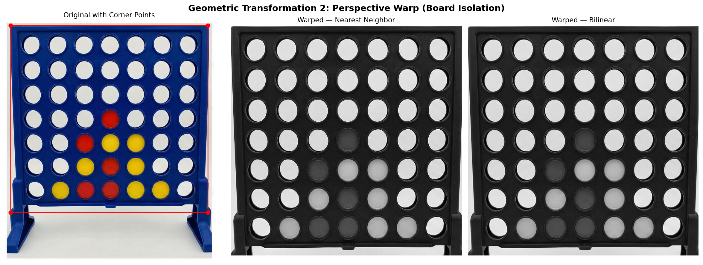

# Vision-Based Connect-4 Robot

**MCTR 1010 — Image Processing for Mechatronics · German University in Cairo · 2025/2026**

| Member | ID |
|---|---|
| Andrew Abdelmalak ([@andrew-abdelmalak](https://github.com/andrew-abdelmalak)) | 55-22771 |
| Daniel Boules | 55-5055 |
| David Girgis | 55-1481 |
| Kirolous Kirolous | 55-18081 |
| Samir Yacoub | 55-25111 |
| Youssef Salama | 55-0540 |

A Raspberry Pi 4 + Arduino Uno robot that plays Connect-4 autonomously: a Pi Camera V2 captures the board, an OpenCV pipeline extracts the 6×7 game state, a minimax search picks the robot's move, and an Arduino-driven dispenser drops the token — then the camera re-verifies the move.



---

## Repository Structure

```
connect-4-robot/
├── arduino/
│   ├── m1_servo_gate_controller/
│   │   └── m1_servo_gate_controller.ino
│   └── ms3_connectfour_dispenser/
│       └── ConnectFour_Dispenser.ino
├── src/
│   ├── image_pipeline/
│   │   ├── Image.png
│   │   ├── m1_image_acquisition.py
│   │   └── m2_member1_pipeline_notebook.ipynb
│   └── runtime/
│       ├── connect4_brain.py
│       └── train_cell_model.py
├── paper/
│   ├── figures/
│   │   ├── Image.png
│   │   ├── m1_proteus_circuit.png
│   │   ├── m2_brightness_adjustment.png
│   │   ├── m2_contrast_scaling.png
│   │   ├── m2_input_board.png
│   │   ├── m2_perspective_warp.png
│   │   ├── m2_rotation_comparison.png
│   │   └── m2_smoothing_comparison.png
│   ├── IEEEtran.cls
│   ├── main.tex
│   ├── main.pdf
│   └── references.bib
├── results/
│   ├── Image.png
│   ├── m1_proteus_circuit.png
│   ├── m2_brightness_adjustment.png
│   ├── m2_contrast_scaling.png
│   ├── m2_input_board.png
│   ├── m2_perspective_warp.png
│   ├── m2_rotation_comparison.png
│   └── m2_smoothing_comparison.png
├── docs/
│   ├── MS1_Literature_Review.pdf
│   ├── MS2_Pipeline_Hardware.pdf
│   ├── MS3_Closed_Loop_Integration.pdf
│   ├── MS4_5_Final_Report.pdf
│   └── Final_Presentation.pptx
├── .gitignore
├── CHANGELOG.md
├── CONTRIBUTING.md
├── LICENSE
├── requirements.txt
└── README.md
```

## System Overview

```
Camera → Pi 4 (OpenCV pipeline) → 6×7 matrix → Minimax → Serial → Arduino → Motors → Board → Camera (verification)
```

Seven stages: image acquisition → vision pipeline → state validation → minimax search → serial link → actuation → closed-loop verification.

## Key Parameters

| Parameter | Value |
|---|---|
| Rotation angle θ | 15° CCW (bilinear) |
| Perspective warp output | 800×800 px |
| Brightness offset c | +30 |
| Contrast α / β | 1.4 / 0 |
| Gaussian kernel | 5×5 |
| HSV red (range 1) | [0,80,50] → [10,255,255] |
| HSV red (range 2) | [160,80,50] → [179,255,255] |
| HSV yellow | [18,100,80] → [42,255,255] |
| Occupancy threshold | ≥ 30 px |
| Minimax depth | 5 (alpha-beta pruning) |
| Serial baud | 9600 |
| Carriage PWM | 100/255 |
| Magazine fast / slow PWM | 50 / 30 |
| Encoder target / slow-down | 430 / 40 pulses |
| ML confidence fallback | 0.65 |
| RandomForest trees / depth | 200 / 10 |
| ML features | 18-dim |
| Verification timeout | 10 s (poll 0.4 s) |
| Preview / analysis FPS | 5 / 1 |

## Test Results

| Metric | Result |
|---|---|
| HSV classifier accuracy | 98% |
| Auto-hybrid classifier accuracy | 96% |
| ML-only classifier accuracy | 91% |
| Drop success (140 trials) | 95% overall |
| End-to-end task time | 7.5 s avg (3–15 s range) |
| Integration tests | 31/31 passed |
| Pi 4 per-frame time | 16.81 ms |
| Laptop per-frame time | 6.85 ms |
| Total BOM cost | 6,100 EGP |

## Key Equations

**Rotation** (θ = 15°):

$$\begin{bmatrix} x' \\ y' \end{bmatrix} = \begin{bmatrix} \cos\theta & -\sin\theta \\ \sin\theta & \cos\theta \end{bmatrix} \begin{bmatrix} x - c_x \\ y - c_y \end{bmatrix} + \begin{bmatrix} c_x \\ c_y \end{bmatrix}$$

**Perspective warp** (homography to 800×800):

$$\lambda \begin{bmatrix} u \\ v \\ 1 \end{bmatrix} = \mathbf{H} \begin{bmatrix} x \\ y \\ 1 \end{bmatrix}$$

**Brightness** (c = +30):

$$I_b(x,y) = \mathrm{clip}(I(x,y) + c)$$

**Contrast** (α = 1.4, β = 0):

$$I_c(x,y) = \mathrm{clip}(\alpha \, I(x,y) + \beta)$$

**Gaussian smoothing** (5×5 kernel):

$$I_G(x,y) = \sum_{i=-k}^{k} \sum_{j=-k}^{k} G_\sigma(i,j)\, I(x-i, y-j)$$

**Cell classification** (state matrix S_{r,c} ∈ {0,1,2}):

$$S_{r,c} = \begin{cases} 1, & M_R(r,c) > \tau_R \\ 2, & M_Y(r,c) > \tau_Y \\ 0, & \text{otherwise} \end{cases}$$

**Minimax** (depth 5, alpha-beta):

$$V(S) = \begin{cases} \max_{a \in \mathcal{A}(S)} V(T(S,a)), & \text{robot turn} \\ \min_{a \in \mathcal{A}(S)} V(T(S,a)), & \text{opponent turn} \end{cases}$$

## Usage

### Python (vision + AI)

```bash
pip install -r requirements.txt

# Simulation mode (no camera/hardware)
python src/runtime/connect4_brain.py --sim

# Live camera mode
python src/runtime/connect4_brain.py

# Train ML cell classifier
python src/runtime/train_cell_model.py
```

### Arduino (dispenser firmware)

1. Open `arduino/ms3_connectfour_dispenser/ConnectFour_Dispenser.ino` in the Arduino IDE.
2. Select board: Arduino Uno.
3. Upload to the Arduino connected via USB to the Raspberry Pi.

### Overleaf (paper)

1. Create a new Overleaf project.
2. Upload `paper/main.tex`, `paper/references.bib`, `paper/IEEEtran.cls`, and all 8 PNGs from `paper/figures/`.
3. Set compiler to **pdflatex**.
4. Compile: pdflatex → bibtex → pdflatex → pdflatex.

## References

1. G. Wölflein and O. Arandjelović, "Determining Chess Game State from an Image," *J. Imaging*, vol. 7, no. 6, p. 94, Jun. 2021.
2. S. M. Zubek, H. Kummerfeld, and J. Wollersheim, "Teach Me What You Want to Play: Learning Variants of Connect Four through Human–Robot Interaction," arXiv:2001.01004, 2021.
3. A. Rezaei and M. S. A. Raihan, "End-to-End Chess Recognition," arXiv:2310.04086, 2023.
4. J. K. Park and S. H. Lee, "Intelligent Lighting System Using Color-Based Image Processing for Object Detection in Robotic Handling Applications," *Appl. Sci.*, vol. 14, no. 7, p. 3002, Apr. 2024.
5. R. Abarkan and J. Wollersheim, "An Open-Source Three-Axis Gantry Robot for Automated Chess Play," *HardwareX*, vol. 17, p. e00517, Mar. 2024.
6. X. Wang, Y. Zhang, and L. Chen, "Structural Design and Position Tracking of the Reconfigurable SCARA Robot by the Pre-Filter AFE PID Controller," *Appl. Sci.*, vol. 12, no. 3, p. 1626, Feb. 2022.
7. OpenCV team, "OpenCV: Open Source Computer Vision Library," 2024. [Online]. Available: https://opencv.org/
8. S. Russell and P. Norvig, *Artificial Intelligence: A Modern Approach*, 4th ed. Pearson, 2020.
9. Raspberry Pi Foundation, "Raspberry Pi 4 Model B," 2024. [Online]. Available: https://www.raspberrypi.org/
10. Arduino, "Arduino UNO R3," 2024. [Online]. Available: https://www.arduino.cc/

## License

MIT — see [LICENSE](LICENSE).
