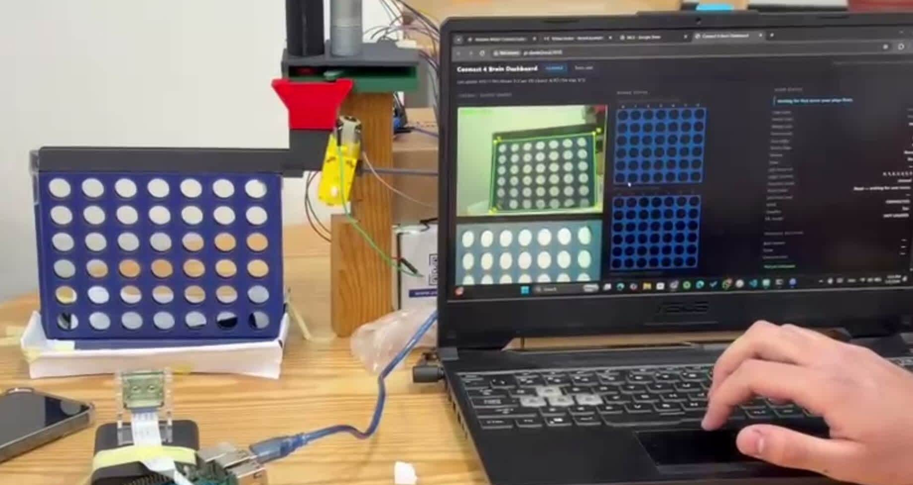
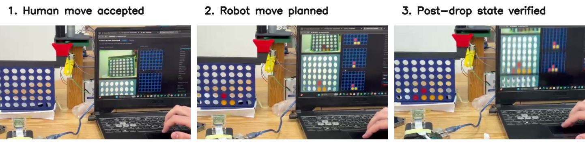
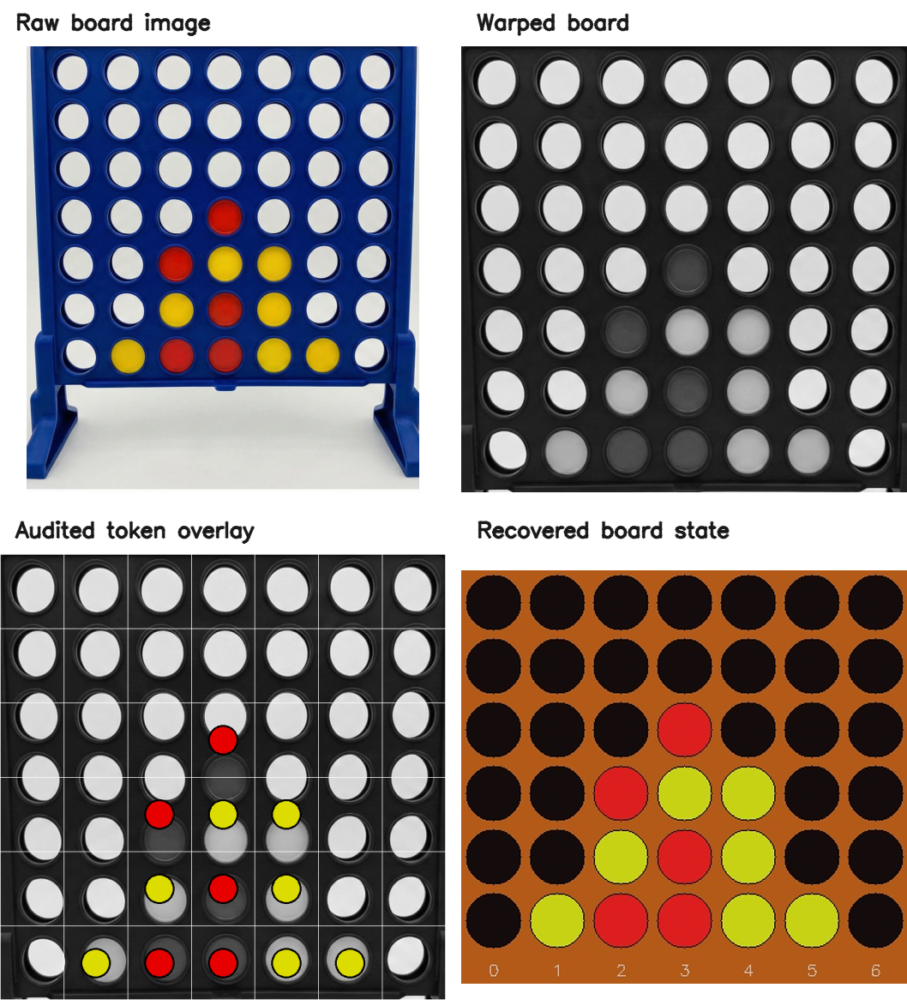

# Vision-Based Connect-4 Robot

  

**MCTR 1010 - Image Processing for Mechatronics | German University in Cairo | Spring 2026**

**Team 21** | Andrew Abdelmalak · Daniel Boules · David Girgis · Kirolous Kirolous · Samir Yacoub · Youssef Salama

**Paper:** [Read the final IEEE-style paper (PDF)](docs/Vision-Based-Connect-4-Robot.pdf) | [LaTeX source](paper/main.tex) | [Final course report](docs/MS4_5_Final_Report.pdf)

This repository documents a full vision-guided Connect-4 robot, not just a vision notebook and not just a motor demo. The final system reads the board with an overhead Raspberry Pi camera, validates the candidate state against physical game rules, selects a move with depth-5 minimax, commands an Arduino-driven dispenser, and then re-uses the camera to verify that the token actually landed where the software expected.

The main result is not that any one subsystem worked in isolation. The main result is that the complete loop worked end-to-end while staying honest about where it still failed: HSV was the strongest practical perception mode under the tested setup, and the real bottleneck shifted from image segmentation to mechanical drop reliability, especially on long travel to the edge columns.

<p align="center">
  
</p>
<p align="center"><em>Final assembled evaluation setup: physical board, overhead dispenser, camera mount, Raspberry Pi, and operator dashboard in one integrated loop.</em></p>

## What This Project Actually Demonstrates

| Core claim | Evidence from the final materials | Why it matters |
|---|---|---|
| Full vision-guided robot with trusted-state validation and re-verification | The pipeline accepts a board only after six legality checks, then advances the internal state only after the camera confirms the robot's physical move in the documented final demo sequences | This prevents the system from silently drifting away from the real board |
| Three vision modes exist, but HSV is the strongest practical mode under the tested conditions | HSV: 98%, Auto: 96%, ML: 91% overall per-cell accuracy across approximately 200 labeled cell ROIs | The simplest mode was also the best mode for the final deployment environment |
| Mechanical drop reliability, not segmentation, is the dominant real-world bottleneck | 95% overall drop success, 100% in columns 1-3, 85% in column 7 | The main remaining failures come from long-travel carriage positioning, not from color recognition |
| The integrated system was demonstrated end-to-end, with honest limits | Representative closed-loop demo sequences plus a reported average end-to-end cycle time of 7.5 s (3-15 s range); separately, the final course materials report 31/31 passed core logic checks | The deliverables prove the loop exists while keeping logic-layer evidence separate from hardware reliability |

## System Story

1. The camera captures an overhead board image.
2. The vision stack localizes the blue frame, warps the board to a canonical top-down view, and classifies each cell.
3. A trusted-state validator rejects impossible transitions such as floating chips, disappearing chips, or multi-chip updates.
4. A depth-5 minimax solver chooses the robot move from the accepted state.
5. The Raspberry Pi sends the target column to the Arduino over 9600-baud serial.
6. The carriage positions the dispenser, the magazine releases one token, and the camera re-reads the board to confirm the physical result before the state advances.

<p align="center">
  
</p>
<p align="center"><em>Closed-loop proof sequence from the final demo: a human move is accepted, the robot plans its response from the trusted state, and the post-drop board is only accepted after the camera confirms the physical outcome.</em></p>

## Vision Pipeline

The deployed runtime uses a geometry-first, inspection-friendly pipeline rather than an opaque end-to-end model. The board is localized from the blue frame, warped to an `800x800` view, brightened and contrast-adjusted (`+30`, `alpha = 1.4`), smoothed with a `5x5` Gaussian kernel, partitioned into a `6x7` lattice, and then interpreted by one of three classifier modes.

<p align="center">
  
</p>
<p align="center"><em>One board position traced through the final perception chain: raw board image, warped board, audited token overlay, and recovered discrete board state.</em></p>

### Classifier modes

Measured on approximately 200 labeled cell ROIs captured under the final deployment lighting:

| Mode | Empty | Red | Yellow | Overall | Practical reading |
|---|---:|---:|---:|---:|---|
| HSV | 99% | 98% | 98% | **98%** | Best final deployment mode under the tested indoor setup |
| Auto | 97% | 95% | 96% | **96%** | Useful hybrid path, but still inherits ML mistakes |
| ML | 94% | 92% | 88% | **91%** | Shows extensibility, but not yet strong enough to replace HSV |

## Key Results

| Metric | Result | What it means |
|---|---:|---|
| HSV per-cell accuracy | 98% | The board can be read reliably enough for gameplay under the tested setup |
| Auto per-cell accuracy | 96% | The hybrid path works, but it is not yet the best practical choice |
| ML per-cell accuracy | 91% | Learning alone underperformed the calibrated HSV baseline in the final dataset |
| Drop success overall | 95% | The robot usually completes the physical move correctly |
| Drop success, columns 1-3 | 100% | Short carriage travel is effectively reliable |
| Drop success, column 7 | 85% | Edge-column travel is the dominant failure case |
| End-to-end cycle time | 3-15 s, 7.5 s average | User-visible latency is dominated by mechanics and verification, not raw image processing |
| Final course check count | 31/31 passed | The logic and validation core was stable before hardware uncertainty entered the loop |

## Why The Results Look This Way

1. HSV wins because the final setup was favorable to hue-based reasoning.
The blue board, red tokens, and yellow tokens occupy distinct color regions, and the final evaluation happened under controlled indoor lighting. In that environment, calibrated HSV thresholds captured the problem more directly than a small learned model.

2. The ML path is useful, but not yet strong enough to be the default.
The repo includes ML support because the project required a bonus learning path, but the final evidence does not justify switching away from HSV. The ML branch needs a larger and more varied labeled dataset before it can beat the deterministic baseline.

3. The mechanical bottleneck is visible in the column-by-column reliability curve.
If perception were the dominant problem, failure would track token color or board content. Instead, failure tracks travel distance: inner columns are perfect, while long carriage travel toward the edges degrades. That points directly to time-based positioning error.

4. Trusted-state validation and post-drop verification are what make the integrated robot credible.
Without them, a missed drop or a bad frame would silently poison the internal board state. With them, the robot either proves the move happened or stops in a detectable error state.

The final materials therefore support representative full-loop demonstrations, not a separately counted benchmark suite of completed physical games. That narrower framing is deliberate and matches the evidence actually archived in the course folder.

## Limitations

- The final deployment results were collected with a fixed camera mount, a stable indoor setup, and a known board/background arrangement.
- HSV thresholds remain sensitive to lighting shift, glare, and domain change.
- The carriage is time-based rather than encoder-closed, which is why edge-column reliability degrades first.
- The ML branch is limited by dataset size and therefore remains a secondary mode rather than the recommended default.

## Final As-Built BOM

| Component | Qty | Total (EGP) |
|---|---:|---:|
| Raspberry Pi 4 (4 GB) | 1 | 4,250 |
| Arduino Uno | 1 | 450 |
| Pi Camera 5MP Rev 1.3 | 1 | 275 |
| TT geared DC motor (carriage) | 1 | 50 |
| Encoder DC motor (magazine) | 1 | 420 |
| L298N H-bridge driver | 1 | 75 |
| 12V 1.2A power supply | 1 | 50 |
| Wires, breadboard, structural parts | - | 530 |
| **Total** |  | **6,100** |

This final BOM matters because it reflects the system that was actually demonstrated. Earlier design iterations used a heavier stepper/servo concept, but the final deliverable moved to the lower-cost TT-carriage plus encoder-magazine design.

## Deliverables

- [Final paper PDF](docs/Vision-Based-Connect-4-Robot.pdf)
- [Paper source (`paper/main.tex`)](paper/main.tex)
- [Bibliography (`paper/references.bib`)](paper/references.bib)
- [MS1 literature review](docs/MS1_Literature_Review.pdf)
- [MS2 pipeline and hardware report](docs/MS2_Pipeline_Hardware.pdf)
- [MS3 closed-loop integration report](docs/MS3_Closed_Loop_Integration.pdf)
- [MS4/5 final report](docs/MS4_5_Final_Report.pdf)
- [Final presentation](docs/Final_Presentation.pptx)

## Repository Layout

```text
connect-4-robot-main/
├── arduino/
├── docs/
│   ├── Vision-Based-Connect-4-Robot.pdf
│   ├── MS1_Literature_Review.pdf
│   ├── MS2_Pipeline_Hardware.pdf
│   ├── MS3_Closed_Loop_Integration.pdf
│   ├── MS4_5_Final_Report.pdf
│   └── Final_Presentation.pptx
├── paper/
│   ├── IEEEtran.cls
│   ├── main.tex
│   ├── references.bib
│   └── figures/
│       ├── final_hardware_overview.jpg
│       ├── final_vision_pipeline.png
│       └── final_closed_loop_sequence.png
├── results/
├── src/
├── CHANGELOG.md
├── CONTRIBUTING.md
├── LICENSE
├── requirements.txt
└── README.md
```

## Run

### Python

```bash
pip install -r requirements.txt

# Simulation mode
python src/runtime/connect4_brain.py --sim

# Camera mode
python src/runtime/connect4_brain.py

# Retrain the optional ML cell classifier
python src/runtime/train_cell_model.py
```

### Arduino

1. Open `arduino/ms3_connectfour_dispenser/ConnectFour_Dispenser.ino` in the Arduino IDE.
2. Select **Arduino Uno**.
3. Upload the sketch to the board connected to the Raspberry Pi.

## Authors

| Member | ID | GitHub |
|---|---:|---|
| Andrew Abdelmalak | 55-22771 | [@andrew-abdelmalak](https://github.com/andrew-abdelmalak) |
| Daniel Boules | 55-5055 | - |
| David Girgis | 55-1481 | - |
| Kirolous Kirolous | 55-18081 | - |
| Samir Yacoub | 55-25111 | - |
| Youssef Salama | 55-0540 | - |

## License

MIT - see [LICENSE](LICENSE).
